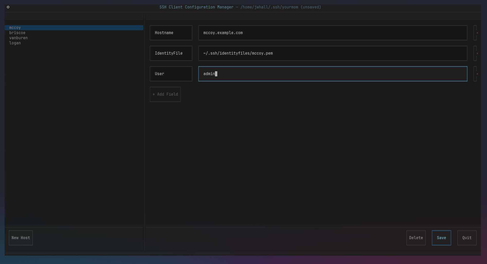

# sshconfigmgr

A terminal UI for managing SSH client configuration files (`~/.ssh/config`).



## Features

- Browse and edit all `Host` blocks in a config file from a single screen
- Add, rename, and delete host entries
- Add configuration fields with autocomplete — all `ssh_config(5)` keywords are available, filtered as you type; single-use keywords already present in the current host block are excluded
- Validates data on save (e.g. Port range), and can optionally have OpenSSH check the whole config before it is written (see [Validating with ssh](#validating-with-ssh))
- Lossless editing: comments, blank lines, indentation, `Key=Value` syntax, `Include`/`Match` blocks and line endings are preserved — only the lines you change are rewritten
- Atomic saves that keep the file's permissions (new files are created `0600`), write through symlinks, and refuse to overwrite changes made by another program without confirmation
- Open any SSH config file at launch or switch files at runtime
- Prompts to save, discard, or cancel on quit (or when opening another file) when there are unsaved changes

## Requirements

- Python 3.11 or later
- [pipx](https://pipx.pypa.io/) for installation (recommended)

[Textual](https://textual.textualize.io/) (≥ 0.70) is installed automatically as a dependency.

## Installation

### From GitHub (recommended)

```sh
pipx install git+https://github.com/jwhall/sshconfigmgr.git
```

### From a local clone

```sh
git clone https://github.com/jwhall/sshconfigmgr.git
pipx install ./sshconfigmgr
```

For active development, install as editable so changes to the source take effect immediately:

```sh
pipx install --editable ./sshconfigmgr
```

## Updating

```sh
pipx upgrade sshconfigmgr
```

Or, if you installed from a local editable clone, `git pull` inside the repo is sufficient — no reinstall needed.

## Usage

```sh
# Open the default SSH config
sshconfigmgr

# Open a specific config file
sshconfigmgr ~/.ssh/config.work
```

If the specified file does not exist you will be prompted to create it.

## Interface

```
┌────────────────────────────────────────────────────────────────────────────┐
│ sshconfigmgr — /home/user/.ssh/config                                      │
├───────────────────────────┬────────────────────────────────────────────────┤
│ HOSTS                     │  Host bastion                                  │
├───────────────────────────┼────────────────────────────────────────────────┤
│                           │ ┌────────────┐ ┌───────────────────────┐ ┌───┐ │
│  bastion                  │ │ HostName   │ │ 10.0.0.1              │ │ × │ │
│  web-prod                 │ └────────────┘ └───────────────────────┘ └───┘ │
│  db-replica               │ ┌────────────┐ ┌───────────────────────┐ ┌───┐ │
│  Match host *.corp        │ │ User       │ │ admin                 │ │ × │ │
│                           │ └────────────┘ └───────────────────────┘ └───┘ │
│                           │ ┌───────────────┐                              │
│                           │ │ + Add Keyword │                              │
│                           │ └───────────────┘                              │
├───────────────────────────┼────────────────────────────────────────────────┤
│ ┌──────────┐┌───────────┐ │                     ┌────────┐┌──────┐┌──────┐ │
│ │ New Host ││ Edit Host │ │                     │ Delete ││ Save ││ Quit │ │
│ └──────────┘└───────────┘ │                     └────────┘└──────┘└──────┘ │
├───────────────────────────┴────────────────────────────────────────────────┤
│ ^S Save   n New   d Delete   o Open   Esc List   q Quit                    │
└────────────────────────────────────────────────────────────────────────────┘
```

### Keyboard shortcuts

| Key        | Action                              |
|------------|-------------------------------------|
| `n`        | New host entry                      |
| `d`        | Delete current host entry           |
| `Ctrl+S`   | Save (opens the Save dialog)        |
| `o`        | Open a different config file        |
| `Esc`      | Return focus to the host list       |
| `q`        | Quit (prompts if unsaved changes)   |
| `j` / `k`  | Move down / up in the host list     |

### Adding a configuration keyword

Click **+ Add Keyword** (or Tab to it and press `Enter`) to open the keyword picker. Start typing a keyword name to filter the list — for example, typing `Loc` narrows it to `LocalCommand` and `LocalForward`. Press `↓` to move from the filter into the list and `↑` on the first entry to return to the filter, or click an entry to select it. Press `Enter` to confirm, `Esc` to cancel.

Keywords that may only appear once per host block (the majority of `ssh_config(5)` directives) are removed from the list once they are already present in the current entry. Keywords that may repeat (`IdentityFile`, `LocalForward`, `RemoteForward`, `DynamicForward`, `CertificateFile`, `SendEnv`, `SetEnv`, `GlobalKnownHostsFile`) remain available.

Custom or non-standard keywords can be typed freely and accepted without selecting from the list.

### Validating with ssh

The Save dialog (`Ctrl+S`) and the Unsaved Changes dialog (on quit or open) have a **Validate config with SSH?** checkbox. It starts checked when `ssh` is on your `PATH` (and is disabled otherwise), and remembers your choice for the rest of the session.

When checked, the config as it would be written is copied to a temporary file and checked with `ssh -G -F <tempfile> sshconfigmgr-validate.invalid`, which parses the file and evaluates its `Host`/`Match` blocks without connecting. If ssh accepts it, the file is saved. If not, you can view ssh's error output (which returns you to the editor without saving) or continue and save anyway.

Limitations of `ssh -G`:

- Unknown keywords, missing arguments and invalid ports are reported anywhere in the file, but some values (e.g. yes/no options) are only checked in blocks that apply to the test host, typically `Host *`.
- `Match exec` commands in your config are **executed** during validation, exactly as they would be when connecting.
- Relative `Include` paths are resolved against `~/.ssh`, as for a user config, and a missing `Include` file is not an error.

## License

MIT
